# Mini Web Application

## 1. Project title and description

**Mini Web Application** is a small, sequential, socket-based HTTP server written in
plain Java (no frameworks), extended from a minimal one-request server into a
mini web application that:

- Serves static resources (HTML, JavaScript, PNG and JPEG images) as real files,
  read as bytes, with correct `Content-Type` and `Content-Length` headers.
- Exposes four hardcoded dynamic services (`/greeting`, `/square`, `/server-time`,
  `/health`) that return JSON.
- Is consumed by an asynchronous JavaScript client (`fetch`) that never reloads
  the page.
- Runs on a single AWS EC2 instance, as a `systemd`-managed background service.

**Problem it addresses.** Before distributing load across multiple servers, it is
necessary to understand the behavior, limits, and assumptions of a single,
non-concurrent server. This lab intentionally keeps the server sequential
(one connection handled at a time) to make that baseline observable, before any
future step introduces threads, load balancers, or multiple instances.

**Scope.** Explicitly out of scope: concurrency, thread pools, load balancers,
autoscaling, containers, databases, authentication, and production-grade security
hardening.

---

## 2. System metaphor and architecture

**System metaphor: a single-window ticket counter.**

Imagine one clerk at one counter window in a small office. The clerk (the Java
server) can only attend one visitor (one TCP connection) at a time. Visitors
line up outside (the operating system's connection queue). The clerk fully
answers one visitor's request — checks an ID, stamps a form, hands back a
paper — before waving in the next person. If a visitor asks something that
takes a while, everyone behind them simply waits; the clerk does not open a
second window.

The building itself has two kinds of counters:
- **The filing cabinet counter** (static resources): the clerk fetches an
  existing document (HTML, JS, PNG, JPG) exactly as it is stored, byte by byte,
  and hands it over with a label describing what kind of document it is
  (the `Content-Type`).
- **The calculation counter** (hardcoded services): for a short, fixed list of
  known requests — "say hello to X", "square this number", "what time is it
  here", "are you open" — the clerk does a small piece of work on the spot and
  returns a freshly written note in a standard format (JSON).

Visitors interact with the office through a **lobby kiosk** (the browser page,
`index.html` + `script.js`): filling a form and pressing a button sends a
request to the counter *without the visitor having to leave the lobby and
re-enter the building* (no page reload) — the kiosk screen updates itself
once the clerk's note comes back.

Finally, the whole office building was **moved to a rented room in another
city** (the AWS EC2 instance) without changing how the clerk works inside it —
only the address visitors use to find the building changed.

### Architecture diagram
                     ┌───────────────────────────────────────────┐
                     │                Browser                     │
                     │  ┌───────────────────────────────────┐    │
                     │  │  index.html + script.js (client)   │    │
                     │  │  - forms (greeting, square)         │    │
                     │  │  - fetch() calls, no page reload    │    │
                     │  │  - loading / result / error states  │    │
                     │  └──────────────┬──────────────────────┘   │
                     └─────────────────┼──────────────────────────┘
                                        │ HTTP requests (GET)
                                        │  over the Internet
                                        ▼
                     ┌───────────────────────────────────────────┐
                     │         AWS EC2 instance (Amazon Linux)     │
                     │  ┌───────────────────────────────────┐    │
                     │  │  Security Group (firewall)          │    │
                     │  │  - SSH (22) restricted to known IPs │    │
                     │  │  - App port open for the client     │    │
                     │  └──────────────┬──────────────────────┘   │
                     │                 ▼                          │
                     │  ┌───────────────────────────────────┐    │
                     │  │  systemd service: mini-webapp       │    │
                     │  │  ┌─────────────────────────────┐   │    │
                     │  │  │   Java Sequential HTTP Server │   │    │
                     │  │  │   (ServerSocket, one           │   │    │
                     │  │  │    connection at a time)       │   │    │
                     │  │  │                                 │   │    │
                     │  │  │  ┌──────────┐  ┌─────────────┐│   │    │
                     │  │  │  │ Static   │  │ Hardcoded    ││   │    │
                     │  │  │  │ resource │  │ services      ││   │    │
                     │  │  │  │ handler  │  │ (/greeting,   ││   │    │
                     │  │  │  │ (public/)│  │ /square,      ││   │    │
                     │  │  │  │          │  │ /server-time, ││   │    │
                     │  │  │  │          │  │ /health)      ││   │    │
                     │  │  │  └──────────┘  └─────────────┘│   │    │
                     │  │  └─────────────────────────────┘   │    │
                     │  └───────────────────────────────────┘    │
                     └───────────────────────────────────────────┘

**Component responsibilities:**

| Component | Responsibility |
|---|---|
| Browser client (`index.html`, `script.js`) | Renders the UI, validates simple input, calls services asynchronously via `fetch`, updates only the relevant part of the page, shows loading/error states. |
| Security Group | Acts as the instance-level firewall: only SSH (restricted) and the application port are open. |
| systemd service | Starts the server predictably on boot/restart, restarts it if it crashes, and routes stdout/stderr to log files. |
| Java sequential HTTP server | Accepts one TCP connection at a time, parses the request line, and dispatches to either the static-resource handler or a hardcoded service handler. |
| Static resource handler | Resolves the requested path against a public resources directory, rejects path traversal, reads the file as bytes, and returns it with the correct `Content-Type`. |
| Hardcoded service handlers | Validate input, compute a small result, and return an escaped JSON body. |

---

## 3. Design decisions

- **Why the server remains sequential:** this lab's purpose is to observe the
  baseline behavior of a single-threaded server before concurrency is
  introduced. Adding threads now would hide exactly the limitation the lab
  wants to make visible (see the sequential-bottleneck evidence in section 10).
- **Why routes are hardcoded:** a routing framework, reflection-based
  dispatcher, or annotations would hide how a raw HTTP request line
  (`GET /square?value=5 HTTP/1.1`) maps to server behavior. A plain `switch`
  over a handful of known paths keeps that mechanism visible.
- **How content types are selected:** a small `Map<String, String>` associates
  known file extensions (`.html`, `.js`, `.png`, `.jpg/.jpeg`) with their MIME
  type. Any unsupported or missing extension results in a `404`, so the server
  never guesses a content type.
- **How unsafe paths are rejected:** the requested path is decoded, resolved
  against the public resources directory with `Path.resolve(...).normalize()`,
  and then checked with `startsWith(publicDir)`. Any resolved path that
  escapes the public directory (e.g. via `%2e%2e` sequences) is rejected with
  a `404`, and the attempt is logged server-side.
- **Why the browser client is asynchronous:** `fetch()` combined with
  `event.preventDefault()` on form submission keeps the page from reloading
  and keeps the UI responsive while a request is pending — independent of how
  the server processes that request internally.
- **Byte-based responses:** all resources (text and binary) are read with
  `Files.readAllBytes` and written directly to the socket's `OutputStream`,
  so the same code path works for HTML/JS text and PNG/JPEG binary data
  without corrupting images.
- **JSON safety:** any untrusted value (e.g. the `name` query parameter) is
  passed through a manual `escapeJson` helper before being inserted into a
  JSON string, so quotes or control characters cannot break the JSON
  structure.

---

## 4. Project structure

├── pom.xml
├── .gitignore
├── README.md
├── docs/
│ └── evidence/ # Screenshots referenced in this README
├── src/
│ ├── main/
│ │ ├── java/
│ │ │ └── co/edu/escuelaing/networking/server/
│ │ │ └── HttpServer.java
│ │ └── resources/
│ │ └── public/ # Static resources served by the app
│ │ ├── index.html
│ │ ├── js/script.js
│ │ └── images/ # logo.png, photo.jpg
│ └── test/
│ └── java/... # (see section 8 — manual validation used)


---

## 5. Prerequisites

- **Java 17** (JDK) or higher.
- **Maven 3.8+**.
- A modern web browser (for the client and DevTools evidence).
- (For deployment) An AWS account with EC2 access — this project was deployed
  using **AWS Academy Learner Lab**.

---

## 6. Installation and build

Clone the repository:

```bash
git clone <YOUR_REPOSITORY_URL>
cd <YOUR_REPOSITORY_NAME>
```

Compile:

```bash
mvn clean compile
```

Package a runnable, dependency-included JAR:

```bash
mvn clean package
```

This produces `target/mini-webapp-lab2-jar-with-dependencies.jar`.

---

## 7. How to run locally

**Default (development) run**, serving resources from
`src/main/resources/public` on port `35000`:

```bash
mvn exec:java
```

**Running the packaged JAR** with an explicit port and public resources
directory (used for deployment as well):

```bash
java -jar target/mini-webapp-lab2-jar-with-dependencies.jar 8080 src/main/resources/public
```

Then open a browser at:

http://localhost:35000 (mvn exec:java)
http://localhost:8080 (packaged jar example above)


**Shutdown:** press `Ctrl+C` in the terminal running the server.

---

## 8. How to use the application

The home page (`index.html`) offers:

| Action | Input | Output |
|---|---|---|
| **Say hello** | A name in the text field | A greeting message, or a friendly error if the name is empty |
| **Calculate square** | A number in the numeric field | The number and its square, or a friendly error if it isn't numeric |
| **Get server time** | none | The server's current timestamp (not the browser's clock) |

All three actions run through `fetch()`; the page never reloads. A loading
indicator appears while a request is pending, a green result area shows
successful responses, and a red error area shows validation errors, server
errors (4xx), or network failures — each triggered differently but all
without exposing raw stack traces or implementation details.

Two additional images (`logo.png`, `photo.jpg`) are served as static resources
to demonstrate binary file handling.

---

## 9. How to run the tests

Given the project timeline, validation for this lab was done through
**manual, repeatable procedures** with `curl` and Postman, following the
functional test matrix in the lab guide:

| Test | Command / action | Expected result |
|---|---|---|
| Load home page | Open `http://localhost:PORT/` in the browser | HTML, JS and images all load (200) |
| Valid greeting | `curl "http://localhost:PORT/greeting?name=Ana"` | `200`, JSON with greeting |
| Invalid greeting | `curl "http://localhost:PORT/greeting"` | `400`, JSON error |
| Valid square | `curl "http://localhost:PORT/square?value=5"` | `200`, `square: 25.0` |
| Invalid square | `curl "http://localhost:PORT/square?value=abc"` | `400`, JSON error |
| Server time | `curl "http://localhost:PORT/server-time"` | `200`, server timestamp |
| Health | `curl "http://localhost:PORT/health"` | `200`, `{"status":"UP"}` |
| Missing static file | `curl -i "http://localhost:PORT/noexiste.html"` | `404` |
| Unsupported method | `curl -i -X POST "http://localhost:PORT/"` | `405` |
| Path traversal | `curl -i "http://localhost:PORT/%2e%2e/%2e%2e/pom.xml"` | `404`, rejection logged server-side |
| Repeated requests | Reload the browser 10+ times in a row | Server keeps responding without restarting |
| Sequential bottleneck | Request `/slow` in one tab, `/health` in another at the same time | `/health` waits for `/slow` to finish (see section 10) |

Screenshots of each of these are in `docs/evidence/` (see section 11).

---

## 10. AWS deployment

The application was deployed to a single **AWS EC2** instance (Amazon Linux),
provisioned through **AWS Academy Learner Lab**, in the `us-east-1` region.

**Steps followed:**

1. Launched a `t3.micro` instance using the Amazon Linux AMI and the Learner
   Lab default key pair (`vockey`).
2. Configured a Security Group allowing:
    - SSH (port 22) restricted to specific known IP ranges (the developer's IP
      and the AWS EC2 Instance Connect IP range for the region).
    - A custom TCP rule for the application port, open for classroom testing.
3. Connected using **EC2 Instance Connect** (browser-based SSH, no local
   private key needed).
4. Installed **Java 17** (`java-17-amazon-corretto`) and **Maven** on the
   instance.
5. Cloned this repository directly onto the instance and built it with
   `mvn clean package`.
6. Copied the packaged JAR and the `public/` resources folder into a
   `~/deploy` directory.
7. Verified the health endpoint **from inside the instance**
   (`curl http://localhost:PORT/health`) before exposing it externally.
8. Configured the application as a **systemd service** (`mini-webapp.service`)
   so it:
    - Starts automatically and restarts on failure.
    - Writes stdout/stderr to log files under `~/deploy/`.
    - Keeps running after the SSH/Instance Connect session is closed.
9. Verified the application from an external browser using the instance's
   public IPv4 address, confirming that static resources and all dynamic
   services work remotely.

**Stopping the service** (for maintenance or before terminating the instance):

```bash
sudo systemctl stop mini-webapp.service
```

No credentials, private keys, or private IP addresses are included in this
repository. The Learner Lab instance is temporary and is terminated after
each session (see section 12).

---

## 11. Evidence and results

All evidence screenshots are stored in `docs/evidence/`. Summary by section:

- **Baseline server (section 2):**  — the
  original one-request server responding with fixed HTML.
- **Static resources (section 3):**  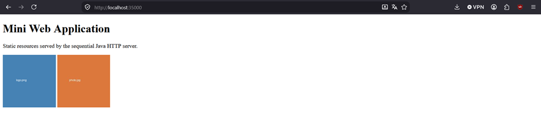 — successful load of
  HTML/JS/images, a `404` for a missing file, a `405` for an unsupported
  method, and a rejected path-traversal attempt.
- **Hardcoded services (section 4):** 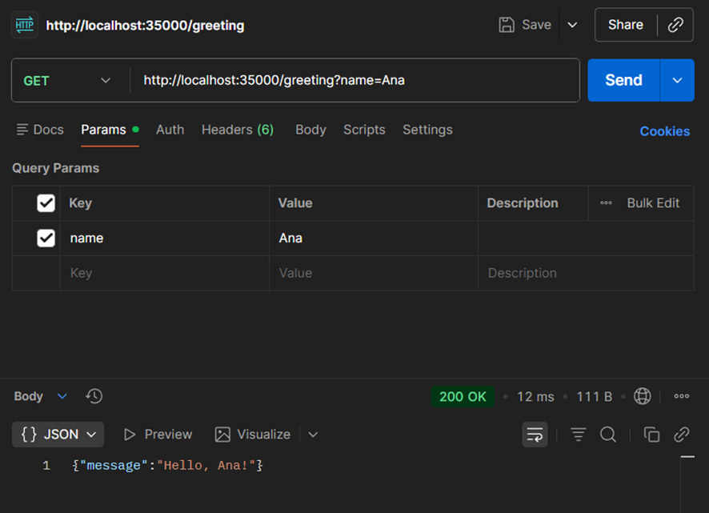 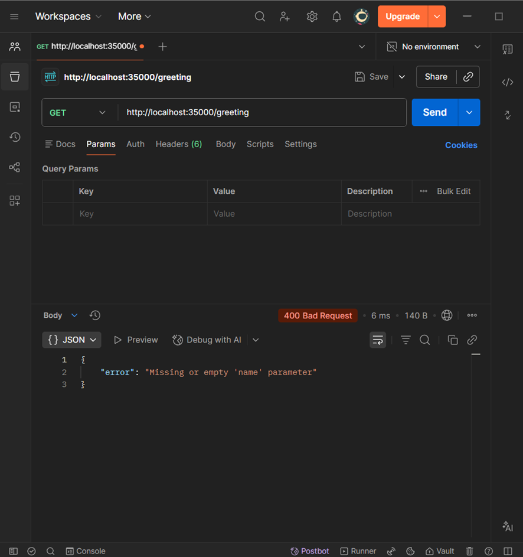 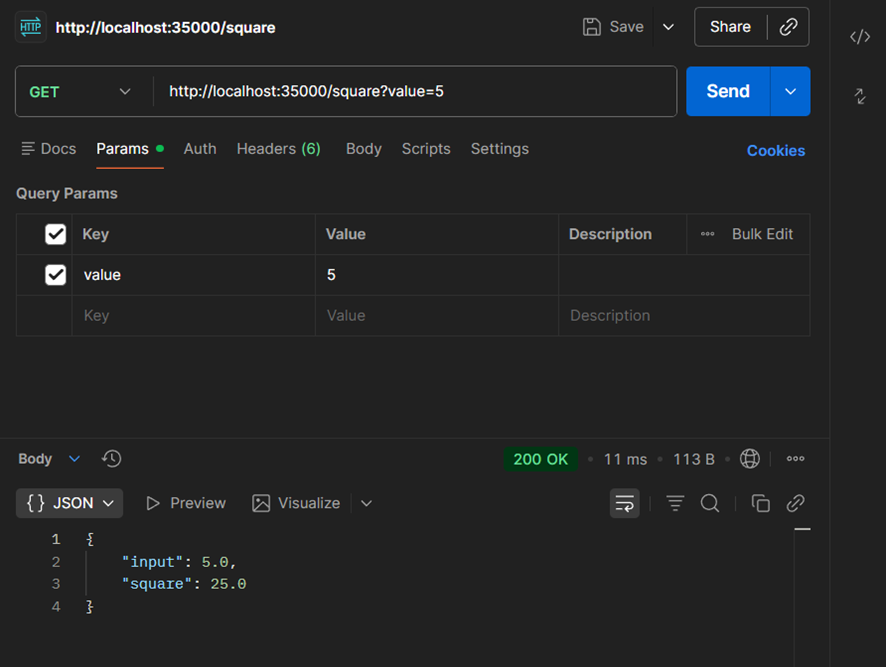 — Postman captures
  of valid and invalid requests for all four services, including a case
  showing safe JSON escaping of an untrusted input.
- **Asynchronous client (section 5):** 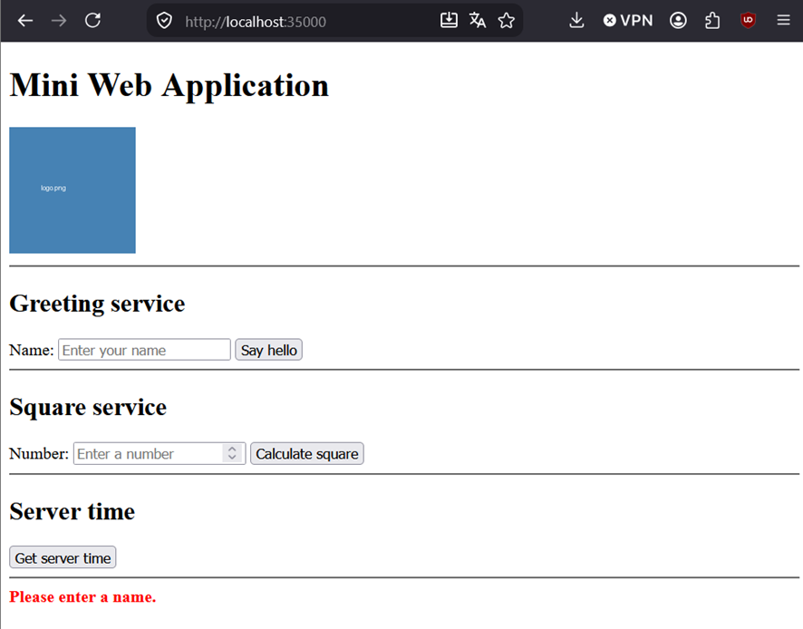 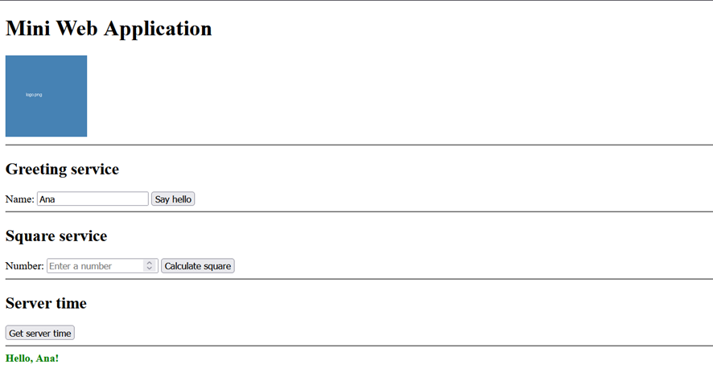 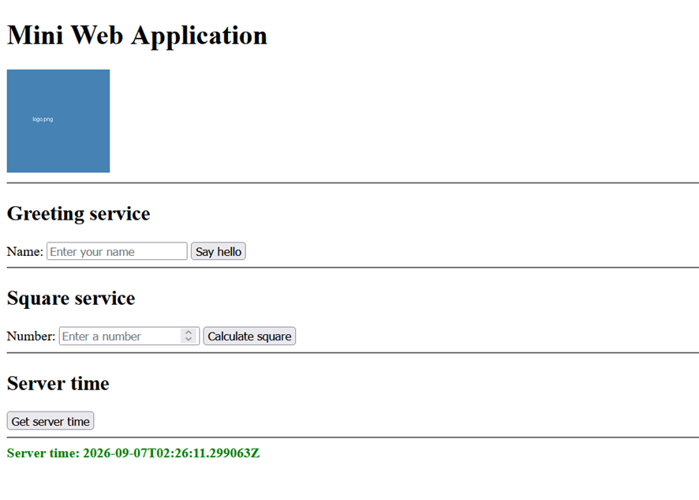 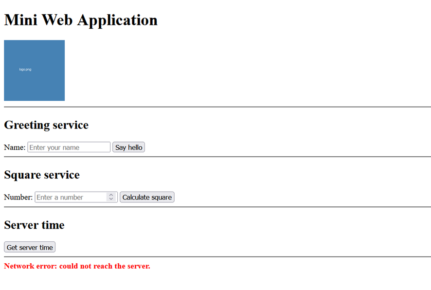 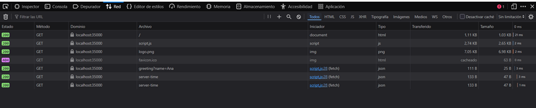 — loading state,
  successful result, validation error, server error, network error, and a
  Network tab confirming no full-page reload occurs.
- **Sequential bottleneck (section 6):** 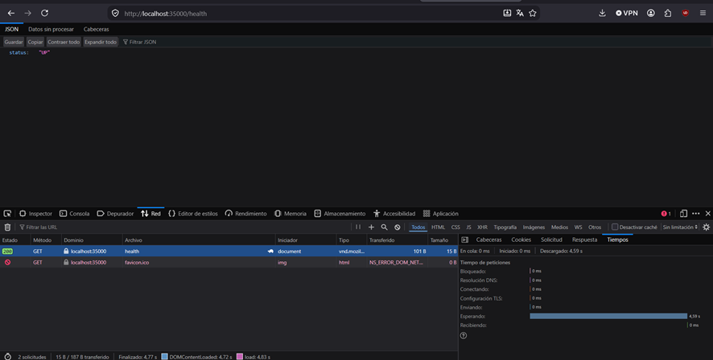
  — a request to `/health` shows a ~4.6s "Waiting (TTFB)" time while a
  concurrent request to `/slow` was being processed, demonstrating that the
  server handles one connection at a time regardless of client-side
  asynchrony.
- **AWS deployment (section 7):** 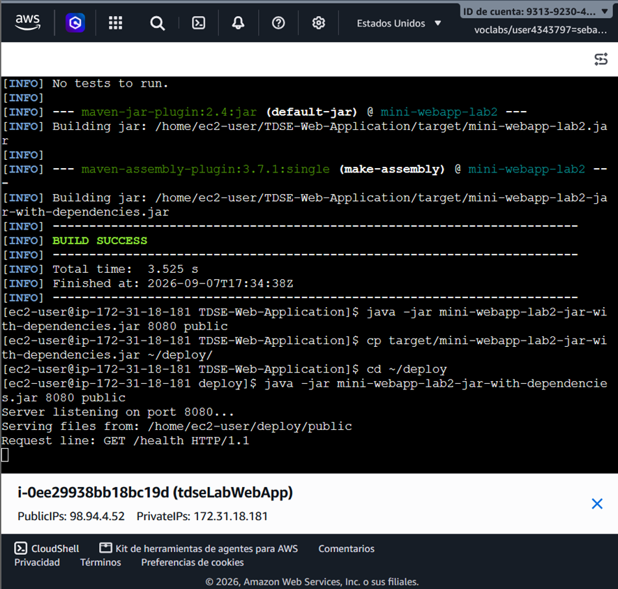 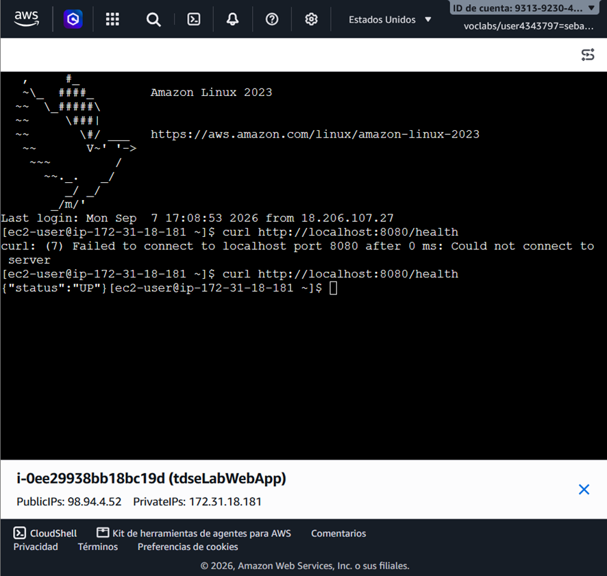 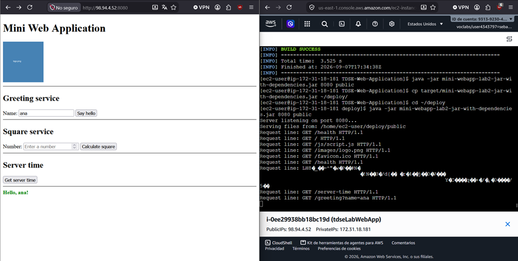 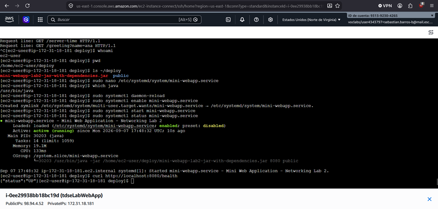 — instance running, security
  group rules, connecting via EC2 Instance Connect, internal health check,
  the application running from the public IP in an external browser, and the
  systemd service status/logs confirming persistence after the SSH session
  closes.

---

## 12. Known limitations

- The server is **strictly sequential**: it processes one TCP connection at a
  time and does not use threads, thread pools, or any concurrency mechanism.
  Under simultaneous load, requests queue up behind one another.
- Only the **GET** method is supported; any other method returns `405`.
- Only a **small, fixed set of hardcoded services** exists
  (`/greeting`, `/square`, `/server-time`, `/health`); there is no general
  routing framework.
- There is **no authentication, HTTPS, or production-grade security
  hardening** — this is a teaching artifact, not a production HTTP server.
- The AWS deployment runs on a **single EC2 instance** with no load
  balancing, autoscaling, or redundancy; it is a single point of failure by
  design, matching the scope of this lab.

---

## 13. Reflection

**1. Why does a single HTML page cause several HTTP requests?**
Because a browser only receives the page's markup on the first request; it
then parses that markup and issues separate requests for every additional
resource it references — the script, each image, and (in this app) any
service calls the page's JavaScript triggers afterward.

**2. Why must image responses be treated as bytes rather than text?**
Binary formats like PNG and JPEG are not valid sequences of text characters
in any charset; encoding/decoding them as text (e.g. through a
`PrintWriter`) can corrupt the bytes. Reading and writing them as raw bytes
guarantees the image reaches the browser unmodified.

**3. What is the role of the response content type?**
It tells the browser how to interpret the bytes that follow — as HTML to
render, as JavaScript to execute, or as an image to decode and display.
Without a correct `Content-Type`, the browser may guess wrong or refuse to
render the resource properly.

**4. What is hardcoded in this design, and what would a routing framework
eventually generalize?**
The mapping from specific request paths (`/greeting`, `/square`, etc.) to
their handling logic is hardcoded via direct `switch`/`if` checks. A routing
framework would generalize this into a declarative table or annotation-based
system that matches arbitrary path patterns (including path variables) to
handler methods automatically, without one explicit branch per route.

**5. Why can the browser remain responsive while the server still handles
requests sequentially?**
Because responsiveness on the client side depends on the browser's own
event loop and asynchronous APIs (`fetch`), not on how the server processes
requests. The browser can keep rendering, animating, and accepting input
while it waits for a response; the server, independently, is still limited
to one connection at a time.

**6. What changed when the server moved to EC2? What did not change?**
What changed: the network address clients use to reach it (a public IP
instead of `localhost`), the operating environment (a remote Linux
instance instead of a local machine), and the process lifecycle
(managed by `systemd` instead of a foreground terminal command). What did
not change: the application's code, its sequential request-handling model,
and the hardcoded routes and static-resource logic.

**7. What happens when two users send slow requests at almost the same
time?**
The second user's request is queued behind the first: the server does not
begin processing it until the first connection has been fully handled and
closed. This was demonstrated by the ~4.6-second "Waiting (TTFB)" observed
on a normally instant `/health` request made while `/slow` was in progress.

**8. What is the next architectural limitation you would address — and why
should concurrency come before load balancing?**
The next limitation to address is the server's inability to handle more than
one connection at a time. Concurrency should come before load balancing
because load balancing only distributes traffic *across* multiple server
instances — if each individual instance can still only serve one client at a
time, adding more instances just multiplies the same bottleneck rather than
solving it. A single, more capable (concurrent) server is a prerequisite for
horizontal scaling to make sense.

---

## 14. Author and acknowledgment

**Author:** Sebatián Enrique Barros Barros

**Acknowledgments:**
- Java networking tutorials from
  [docs.oracle.com/javase/tutorial/networking](https://docs.oracle.com/javase/tutorial/networking/),
  as referenced in the course's networking guide.
- Course instructor's reference example (`WebServer With app`), used as a
  conceptual starting point for the hardcoded routing and asynchronous
  client pattern.
- AWS Academy Learner Lab documentation, for EC2 provisioning and
  connectivity constraints specific to the academic environment.